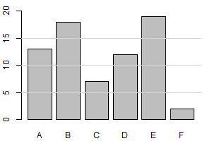

Kontroldarbs, var.4
----------

Mazie pirmskaitļi ir 29, 31, 37


## 1. uzdevums

Tabulā apkopoti dati par dažām pašvaldībām (Avots: **raim.gov.lv**, 2013.g.).

Pašvaldība | Col2 XXX | Col3 | Col4 
---:|---:|---:|---:|---:|
Jelgava | A | D | _____
Jelgavas novads | B | E | _____
Ozolnieki | c | F | _____


1. Jelgava
1. Ierakstīt mērvienību šai skaitļu kolonnai.


## 2. uzdevums

Tabulā doti transporta līdzekļu atiešanas laiki. 

1. Cik ilgs laiks paiet no piektdienas vakara pēdējā reisa līdz nākamajam reisam? (Atbildi ierakstīt stundās un minūtēs, pa vidu rakstot divpunktu -- "hh:mm")
1. Vēl kaut kas


## 3. uzdevums

Pēc proporcijām atrast pareizo joslu diagrammu (t.sk. ar joslām dažādās krāsās)

## 4. uzdevums

Nolasīt sektoru diagrammu; izmantot transportieri. 

## 5. uzdevums

Nolasīt punktu diagrammu (t.sk. ar vairāku grafiku pārklāšanos); 


## 6. uzdevums  

Saskaitīt novērojumus, izveidot tabulu ar skaitiem – cik pieder katrai kategorijai

## 7. uzdevums 

Atrisināt proporciju uzdevumu. 

## 8. uzdevums

Atrisināt uzdevumu ar procentiem. Darbaspējīgā vecuma procenti. Nodokļu procenti.

## 9.uzdevums 

Doti kaut kādi reāli dati (ražas skaitļi, utml.).
Atrast aritmētisko vidējo. 

## 10. uzdevums	

Aritmētiskā vidējā īpašības. 
Noskaidrot, par cik kāds skaitlis iespaido aritmētisko vidējo. 

## 11. uzdevums

Prast sakārtot skaitļus vai vārdus augošā vai dilstošā secībā. 

## 12. uzdevums 

Atrast mediānas 

## 13. uzdevums 	

Atrast modu vai modas. 

## 14. uzdevums

Atrast amplitūdu

## 15. uzdevums

Dota skaitļu virkne: 20, 20, 20, 23, 23, 23, 25, 25, 26, 27, 27, 30.  
Atrast visu skaitļu absolūto un relatīvo biežumu. 

## 16. uzdevums

No joslu diagrammas nolasīt dažādu atzīmju biežumu; aprēķināt to absolūto un relatīvo biežumu.


```
## png 
##   2
```



