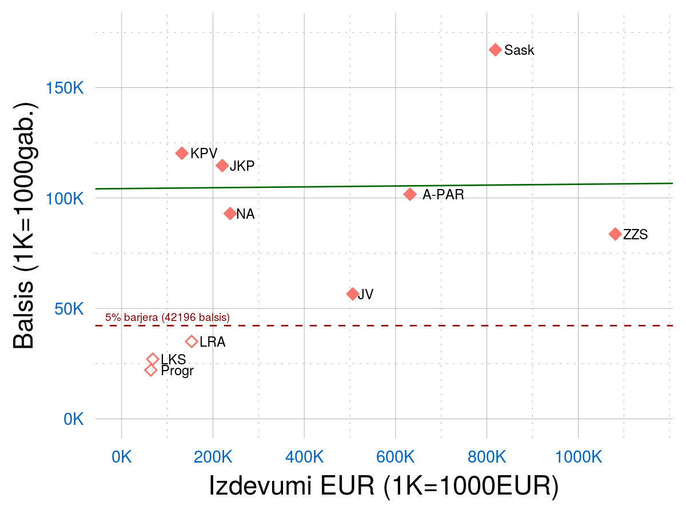

# Partiju tēriņi un rezultāti: Korelācijas

[Uz sākumu](http://85.254.250.28/downloads1/zpd-election-ads/)  
**Anotācija:** Šajā lapā aplūkosim nevis atsevišķo partiju kampaņu efektivitāti, 
bet kā mainās balsu skaits (atkarīgais parametrs - vertikālā jeb Y ass) no kampaņā 
iztērētās naudas (neatkarīgais parametrs - horizontālā jeb X ass). 
Izvilksim lineārās regresijas taisni, kas tuvināti apraksta 
balsu skaita pieaugumu atkarībā no iztērētās naudas un aprēķināsim 
Pīrsona korelācijas koeficientu. Tas parādīs, cik spēcīga ir saņemto 
balsu skaita atkarība no reklāmās ieguldītās naudas. 

## Diagrammas

Softs, ar kuru zīmētas korelāciju diagrammas (valoda R): [correlations.R](correlations.R)

**Iegūtās balsis atkarībā no kampaņā iztērētās naudas:**

**Iegūtās balsis atkarībā no partijas ieņēmumiem priekšvēlēšanu laikā:**

## Lineāra modeļa izmantošana prognozei

Mēģināsim novērtēt, cik dārga vēlēšanu kampaņa ir nepieciešama, lai 
partija pārsniegtu 5% barjeru. 13.Saeimas vēlēšanās derīgo 
aplokšņu skaits bija 843920. Tādēļ šajās vēlēšanās 5% barjera
(mazākais balsu skaits, kas partijai jāsaņem visos 5 vēlēšanu apgabalos kopā, 
lai varētu piedalīties proporcionālajā Saeimas krēslu dalīšanā) ir 
**42196 balsis**. No visām 16 partijām aplūkojām tikai tās, kuras 
šo barjeru pārsniedza vai arī bija pietiekami tuvu tās pārsniegšanai 
(Latvijas Reģionu Apvienība, Latvijas Krievu savienība un Progresīvie). 

## Secinājumi

1. Jāuzsver, ka korelācija nenozīmē cēloņsakarību. Partijas iztērētajai 
naudai un saņemto balsu skaitam, nenoliedzami, ir kopsakars: Partijas, kuras
ir lielas, Latvijas politikā darbojas pietiekami aktīvi, izveidojušas
plašu atbalsta tīklu reģionālo organizāciju izskatā, parasti arī saņem 
salīdzinoši daudz balsu vēlēšanās un daudz ziedojumu, ko izmantot sevis reklamēšanai. 
Tas tomēr nenozīmē, ka nauda tieši (vai vēl jo vairāk - lineāri) iespaidotu 
vēlēšanu rezultātu, t.i., iztērējot divreiz vairāk naudas, varētu iegūt 
divreiz lielāku rezultātu. 
2. Ir tomēr zināms naudas daudzums, zem kura partijai ir grūti sasniegt 
nospraustos mērķus. To mēģinājām novērtēt lineārajā modelī, lai saprastu, 
ar kādiem sākotnējiem ieguldījumiem jārēķinās, lai varētu pārvarēt 5% barjeru. 
Novērojam, ka dažām partijām (piemēram "Progresīvajiem") bija drusku par maz
naudas, lai veiksmīgi reklamētos.
3. **Ko gribētos pētīt tālāk?** 13.Saeimas vēlēšanas bija drusku neparastas - 
pēc dažu politologu (kuru?) atzinuma tur sacentās "vecie" politiskie spēki - 
Jaunā Vienotība, ZZS, Nacionālā Apvienība ar nosacīti "jaunajiem" 
politiskajiem spēkiem: Attīstībai/PAR, KPV un JKP. Tādēļ var gadīties, ka 
"vecajām" partijām vajadzēja pavisam citādas reklāmas kampaņas, lai varētu 
sacensties ar "jaunajām" un parasti tās izmaksāja krietni dārgāk. 
Tādēļ būtu interesanti aplūkot korelācijas plašākai datu kopai - apskatīt
arī iepriekšējo Saeimu vēlēšanas, pašvaldību vēlēšanas u.c. Tas ļautu 
iegūt precīzākus secinājumus par kampaņu naudas plānošanu.

